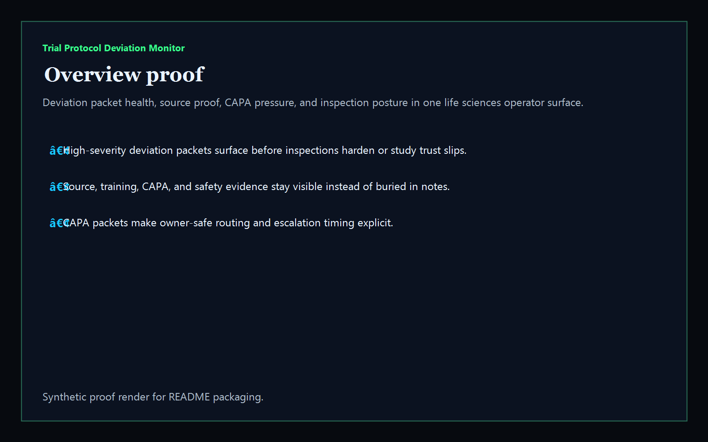
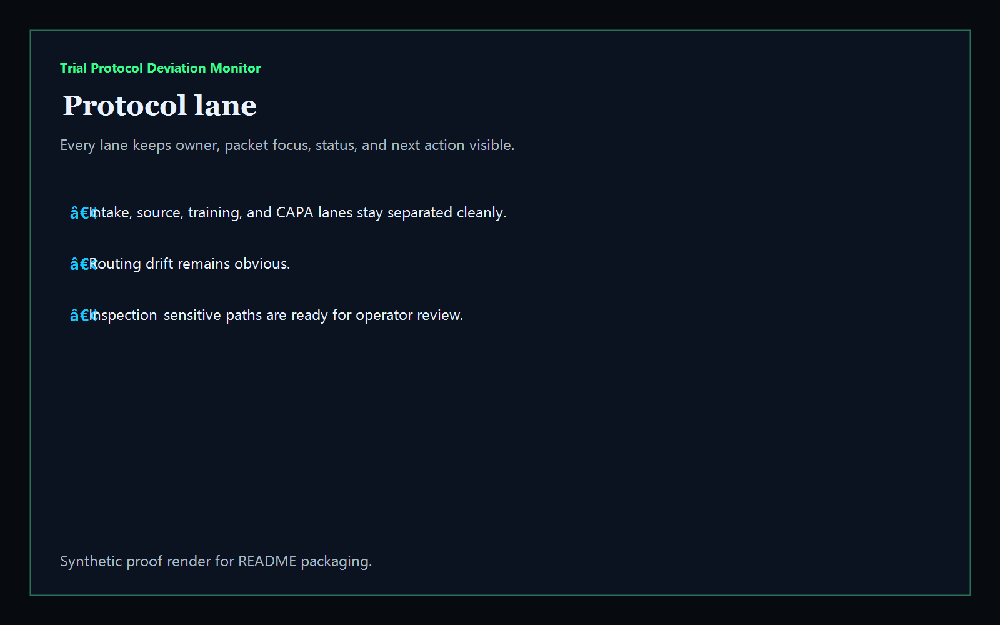
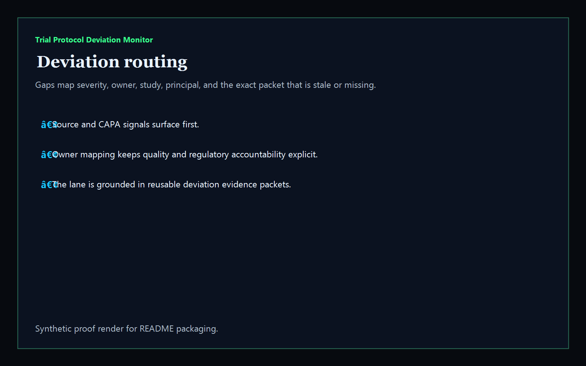
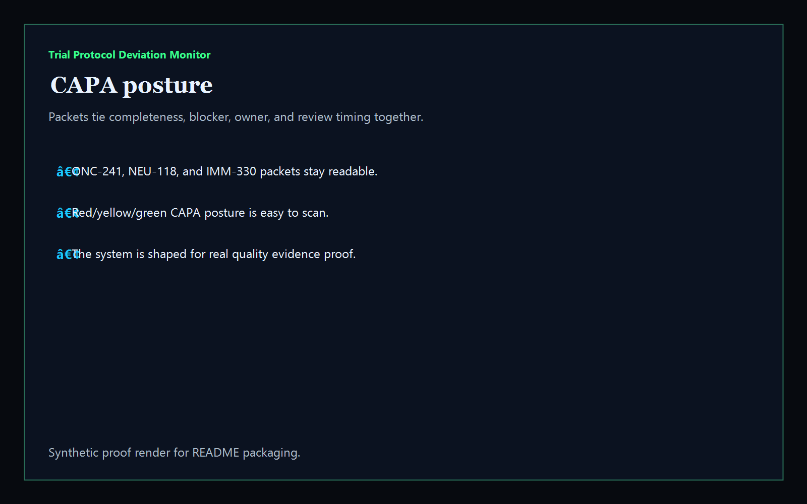

# Trial Protocol Deviation Monitor

[](https://github.com/mizcausevic-dev/trial-protocol-deviation-monitor/actions/workflows/ci.yml)
[](./LICENSE)
[](./.github/dependabot.yml)
[](https://github.com/mizcausevic-dev/trial-protocol-deviation-monitor/actions/workflows/pages.yml)

TypeScript control plane for protocol deviation intake, missing evidence packets, CAPA pressure, and audit-safe routing across life sciences operations.

## Why this exists

- Trial teams lose time when source-data proof, retraining notes, CAPA chronology, and inspection deadlines live in separate systems.
- Findings often harden into inspection pain because routing fails and deviation packets stay incomplete.
- Clinical operations, quality, regulatory, and safety teams all need the same deviation picture without waiting on another spreadsheet.
- Life Sciences buyers care whether the deviation workflow is auditable and recoverable, not whether the dashboard looks “AI-powered.”

## Why this matters (KG Embedded tie-back)

This repo demonstrates the evidence-routing primitive for Pharma / Life Sciences buyers: protocol deviations tied to missing proof, stale packets, CAPA blockers, and owner-safe escalation paths. A B2B SaaS buyer would care because deviation routing and inspection readiness often need to surface inside customer-facing operator tools without exposing unsafe GxP systems or write-heavy backends. Kinetic Gain Embedded extends this into security-first in-product analytics for CAPA-aware and evidence-aware reporting across trials and quality operations, see [kineticgain.com/embedded](https://kineticgain.com/embedded).

## Routes

- `/`
- `/protocol-lane`
- `/deviation-routing`
- `/capa-posture`
- `/verification`
- `/docs`

## API

- `/api/dashboard/summary`
- `/api/protocol-lane`
- `/api/deviation-routing`
- `/api/capa-posture`
- `/api/verification`
- `/api/sample`

## Screenshots






## Local Development

```powershell
cd trial-protocol-deviation-monitor
npm install
npm run dev
```

Open:
- [http://127.0.0.1:5523/](http://127.0.0.1:5523/)
- [http://127.0.0.1:5523/protocol-lane](http://127.0.0.1:5523/protocol-lane)
- [http://127.0.0.1:5523/deviation-routing](http://127.0.0.1:5523/deviation-routing)
- [http://127.0.0.1:5523/capa-posture](http://127.0.0.1:5523/capa-posture)
- [http://127.0.0.1:5523/verification](http://127.0.0.1:5523/verification)

## Validation

- `npm run build`
- `npm run test`
- `npm run demo`
- `npm run smoke`
- `npm run render:assets`

## Production status

| Aspect | Status |
|--------|--------|
| CI | Node 20 + 22 matrix — lint · typecheck · coverage · build · demo · smoke · `npm audit` ([workflow](./.github/workflows/ci.yml)) |
| Test coverage | `src/services/` coverage gate maintained via `vitest` |
| License | [AGPL-3.0-or-later](./LICENSE) |
| Dependencies | Dependabot weekly (npm + GitHub Actions); `npm audit --audit-level=high` in CI |
| Data handling | Synthetic, non-PHI trial and deviation packets only. No live subject, site, or sponsor records. |
| Deploy | Static prerender → **https://trials.kineticgain.com/** (GitHub Pages, [pages workflow](./.github/workflows/pages.yml)) |

## Docs

- [Kinetic Gain Embedded tie-back](./docs/KINETIC_GAIN_EMBEDDED.md)
- [Changelog](./CHANGELOG.md)

## Part of the Kinetic Gain Suite

Operator surface in the [Kinetic Gain Suite](https://suite.kineticgain.com/) — a portfolio of buyer-readable control planes spanning security posture, compliance evidence, data-platform governance, FinOps, and operator workflows. Apex: [kineticgain.com](https://kineticgain.com/).

## Related surfaces

- [**`prior-authorization-evidence-router`**](https://github.com/mizcausevic-dev/prior-authorization-evidence-router) — healthcare approval evidence routing
- [**`regulatory-reporting-mart`**](https://github.com/mizcausevic-dev/regulatory-reporting-mart) — reporting and deadline operations
- [**`claim-evidence-routing-desk`**](https://github.com/mizcausevic-dev/claim-evidence-routing-desk) — insurance evidence and routing posture
